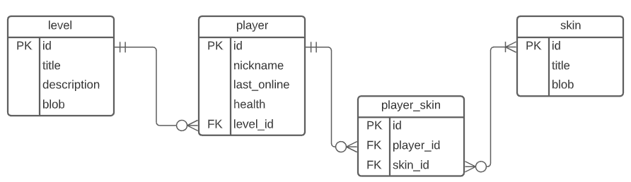
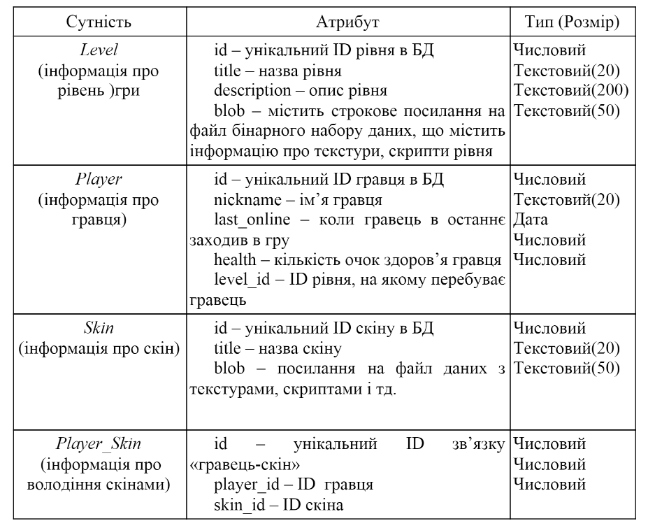
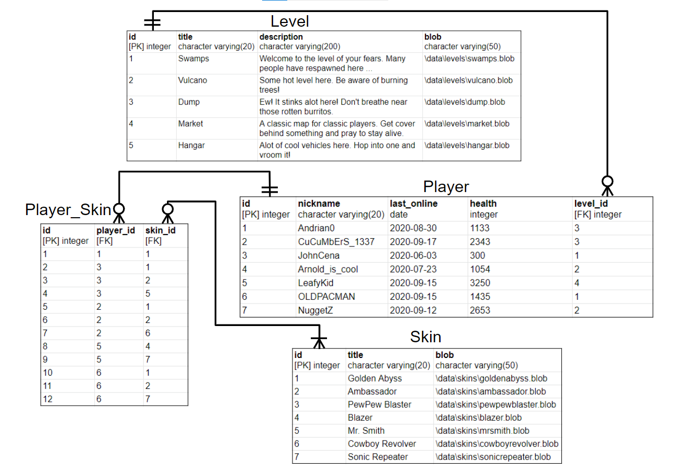
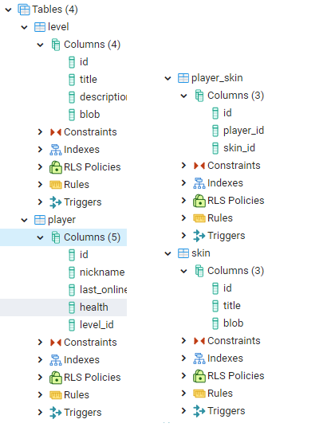
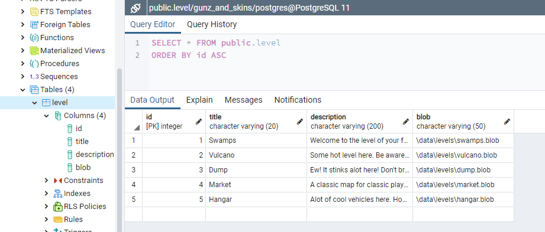
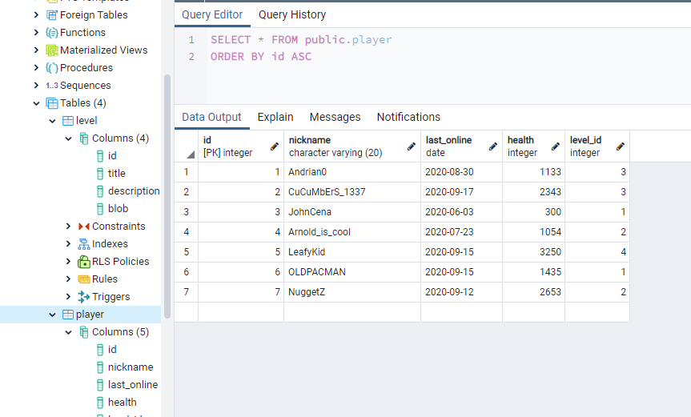
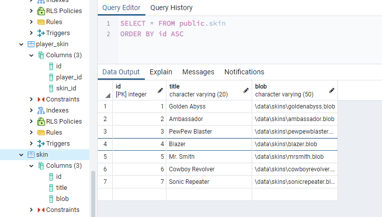

# Проектування бази даних та ознайомлення з базовими операціями СУБД PostgreSQL

## Предметна галузь:

База даних відеогри “Gunz and Skins”

## Графічна ER модель

## Сутності БД

## Структура нормалізованої бази даних з назвами таблиць та зв’язками між ними

## Вміст БД

## Запити до БД

